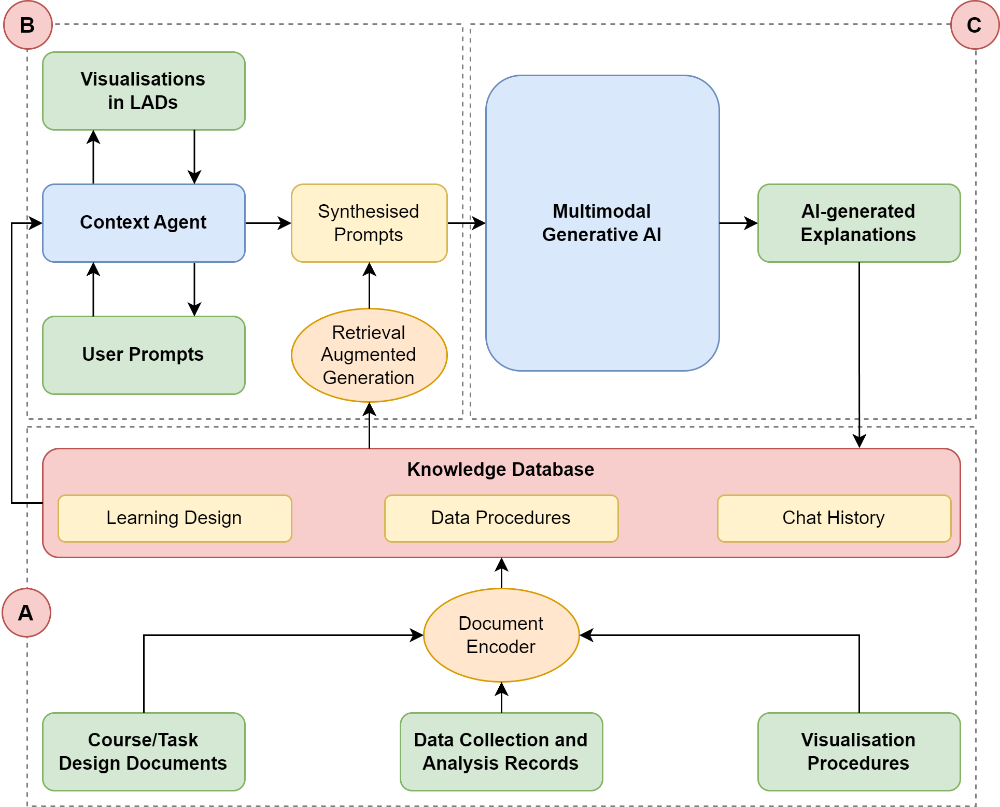
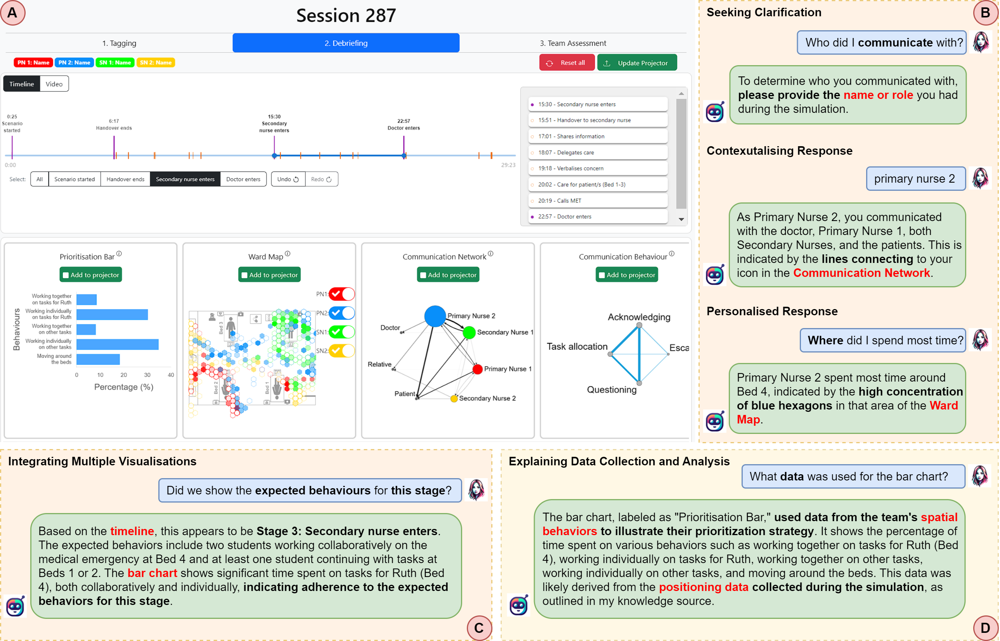

<h1 align="center"> 🤖 VizChat: Enhancing Learning Analytics Dashboards with Contextualised Explanations </h1>

VizChat is an open-source Chrome extension designed to augment web-based Learning Analytics Dashboards (LADs) by providing contextualized explanations for visualizations through integrating multimodal generative AI and Retrieval-Augmented Generation (RAG). VizChat comprises three main components: 

- A) a knowledge database that stores relevant contextual information as vector embeddings, 

- B) a prompt synthesis mechanism through a context agent that crafts context-specific prompts,

- C) a contextualized explanation generation process that leverages a multimodal generative AI model to produce explanations based on the enriched prompts. 

This architecture enables VizChat to deliver precise, relevant, and easy-to-understand explanations, enhancing the educational value of LADs by making them more accessible and informative for users.

<p align="center">

</p>

**Use Cases**: Here is an example of using VizChat to facilitate students' in-depth understanding of a complicated LAD to support reflective practices. As shown by the examples, VizChat can provide contextualized and personal responses by utilising the insights presented in one or more visualizations and explaining the underlying data collection and analysis procedures.

<p align="center">

</p>

## How to Install

### Obtain the Extension

You can find the extension in zip format in **releases tab**. 
Click here to download the [Chrome extension package](https://github.com/LinxZhao/VizChat-pub/releases/download/0.2.1/chromium.zip).

You can also clone the repository and compile the extension yourself. Ensure npm and node.js are installed:
- Recommended npm version: >=10.5.0
- Recommended node.js version: >=21.7.2

Commands to run:

```
npm install
npm run build
```

### Extension Setup

Once downloaded, navigate to [your Chrome extension page](chrome://extensions/). Activate **developer mode** in the top right corner, then drag and drop the zip file (**chromium.zip**) onto the page.

If installed successfully, it will appear in your extension list. Click 'Details', then enable 'Pin to toolbar' to make VizChat accessible from your extension bar.

To use VizChat, add an OpenAI API key in the **Advanced** options page, accessible by right-clicking the VizChat icon and selecting Option, then the Advanced tab. This key is stored locally for privacy.

Now, refresh a web page, click the VizChat icon, and start a chat to ask questions about the visible part of the webpage.

## Features

### Web-based LADs Interaction

To engage with VizChat, click its icon. Note that VizChat's analysis and discussion capabilities are limited to the portion of the Learning Analytics Dashboards (LADs) currently visible on your screen. If you wish to explore another section, you must adjust your view and initiate a new chat session. 

It's important to remember that VizChat's ability to capture the webpage relies on Chrome's extension screenshot functionality, which is only triggered when you activate the chat (for instance, by right-clicking the icon). Consequently, if your LADs include multiple tabs or sections requiring separate views, you'll need to reactivate VizChat each time you switch to a different tab or section to ensure it can analyze the new content accurately.

### Knowledge File Integration
Add PDFs as knowledge files in the **Advanced** options. VizChat stores these locally and uses them to provide more relevant responses based on your queries. Note, only the pertinent sections of these documents are sent with your question for privacy.

## Citation
Please use the following citation for academic purposes:

```
@inproceedings{yan2024vizchat,
  title={VizChat: Enhancing Learning Analytics Dashboards with Contextualised Explanations using Multimodal Generative AI Chatbots},
  author={Yan, Lixiang and Zhao, Linxuan and Echeverria, Vanessa and Jin, Yueqiao and Alfredo, Riordan and Gasevic, Dragan and Martinez-Maldonado, Roberto},
  booktitle={Proceedings of the 25th International Conference on Artificial Intelligence Education},
  year={2024},
  organization={Springer}
}
```

## Contact
Project Leads:
- Lixiang Yan: Lixiang.Yan@monash.edu
- Linxuan Zhao: Linxuan.Zhao@monash.edu

## Acknowledgement
This extension builds upon the work found at: https://github.com/josStorer/chatGPTBox
